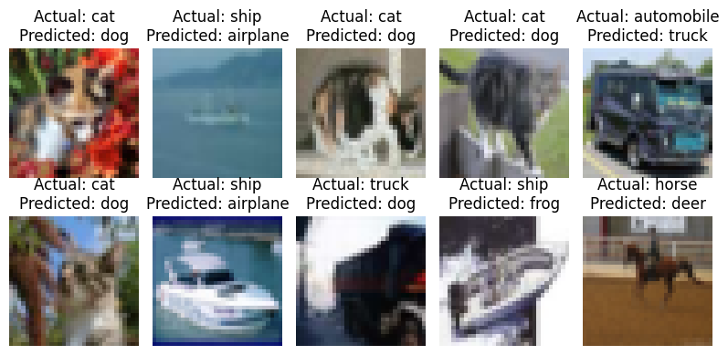

# ERA-V2-S8
We are making 3 CNN models with same architecture
* 	C1 C2 c3 P1 C4 C5 C6 c7 P2 C8 C9 C10 GAP c11 [cN is 1x1 Layer]
* 	Total number of parameters: 50,000
* 	Number of Epochs: 20
The models have 3 different kind of normalization:
* 	Batch Normalization
* 	Layer Normalization
* 	Group Normalization

The following is the comparison of the models:
|                     | Batch Normalization | Layer Normalization| Group Normalization|
|---------------------|---------------------|--------------------|--------------------|
| Number of Parameters| 49,432| 50,026| 48,824|
| Number of Epochs    | 20| 20 | 20 |
|Training Accuracy	|75.50	|61.69|76.91|
Test Accuracy|75.89	|63.28	|77.41|

Based on the analysis of these 3 models, here is a comparison:
1.	**Batch Normalization**: *This technique normalizes the inputs across the mini-batch.* The test accuracy is slightly higher than the training accuracy, indicating a good fit to the data without overfitting. This suggests that batch normalization has helped the model generalize well to unseen data.

2.	**Layer Normalization**: *Unlike batch normalization, layer normalization normalizes the inputs across features instead of the batch.* However, it has significantly lower training and test accuracies compared to the other two models. This could indicate that layer normalization might not be as effective for this particular dataset or model architecture, leading to underfitting.

3.	**Group Normalization**: *This technique divides channels into smaller groups and normalizes within each group*. The test accuracy is slightly higher than the training accuracy, indicating a good fit to the data without overfitting. This suggests that group normalization has been the most effective among the three techniques for this particular task.

Following is the comparison of all 3 models Training Accuracies.

In **conclusion**, the Group Normalization model appears to perform the best among the three models based on the provided data. 
